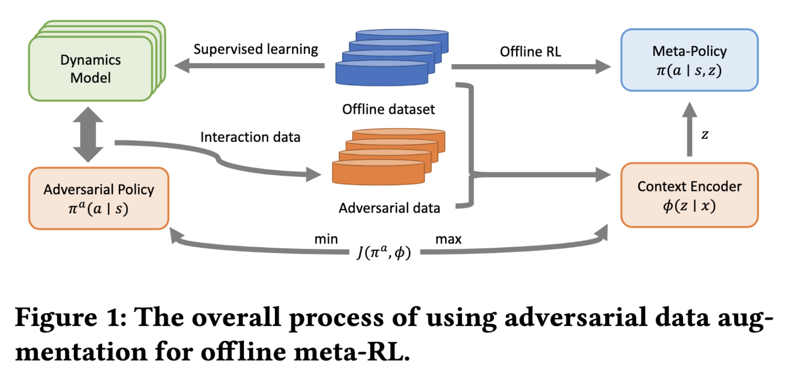

# ReDA: Disentangling Policy from Offline Task Representation Learning via Adversarial Data Augmentation

[Paper Link](http://arxiv.org/abs/2403.07261)

This repo is an implementation of the AAMAS 2024 paper "Disentangling Policy from Offline Task Representation Learning via Adversarial Data Augmentation".



### Installation 

Use the following snippet to create a virtual environment and install the required packages.

```bash
conda create -n reda python=3.10 -y
conda activate reda
conda install -c anaconda swig -y
conda install -c conda-forge mesalib glew glfw -y 
pip install -r requirements.txt
```

### Online Data Collection

We use an online SAC algorithm to collect data at its every checkpoint. Run the following code to generate data in our desired format: 

```bash
PYTHONPATH=.:$PYTHONPATH python onlinerl/collect_sac.py --env <env> --type <grav/dofd> --degree <0.5/1.0/1.5>
```

To create multiple tasks for meta-training and meta-test, we choose task variants with different gravity or dof-damping factors. To construct the training dataset, the coefficient of gravity or dof-damping is set to 0.5, 1.0, and 1.5. For example, if you want to reproduce the `Hopper Gravity-1` task set in our experiments. You should collect data using the following commands:

```bash
PYTHONPATH=.:$PYTHONPATH python onlinerl/collect_sac.py --env Hopper-v2 --type grav --degree 0.5
PYTHONPATH=.:$PYTHONPATH python onlinerl/collect_sac.py --env Hopper-v2 --type grav --degree 1.0
PYTHONPATH=.:$PYTHONPATH python onlinerl/collect_sac.py --env Hopper-v2 --type grav --degree 1.5
```

The data is stoned in the `onlinerl/data` folder. 

### Run ReDA

You can run the ReDA algorithm after acquiring the dataset using the following command:

```bash
bash offline_mbsac.sh <env> <ckpt-num-for-training:1/3/5> <grav/dofd>
```

The first parameter specifies the environment. The second parameter specifies the number of checkpoints whose collected data will be used for training. The third parameter specifies the task sets from grav or dof-damping. For example, if you want to run in the `Hopper Gravity-1` task set from our experiments, you should run the following command:

```bash
bash offline_mbsac.sh Hopper-v2 1 grav
```

### Citations
```
@misc{jia2024disentangling,
      title={Disentangling Policy from Offline Task Representation Learning via Adversarial Data Augmentation}, 
      author={Chengxing Jia and Fuxiang Zhang and Yi-Chen Li and Chen-Xiao Gao and Xu-Hui Liu and Lei Yuan and Zongzhang Zhang and Yang Yu},
      year={2024},
      eprint={2403.07261},
      archivePrefix={arXiv},
      primaryClass={cs.LG}
}
```
